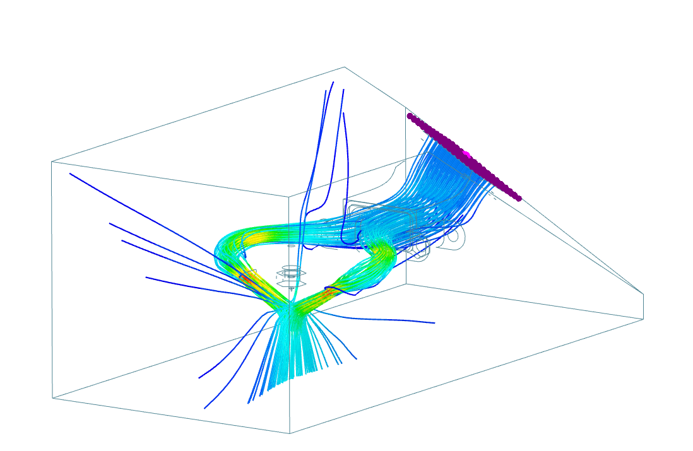

The Horns Duct v2 project is now a part of the EVA platform. I get a lot of questions around the performance of the layer cooling. I can't give you more than subjective promises and the result of a simulation I did for the EVA platform:

!!! info
    the air on the inlet was calibrated to a Sunon MF50151VX-B00U-A99 radial fan and the 60deg version of the back ([more on back fan angles](../#back-fan-duct-angles))

