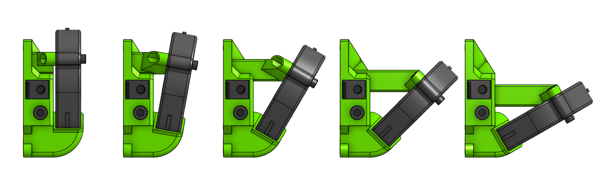
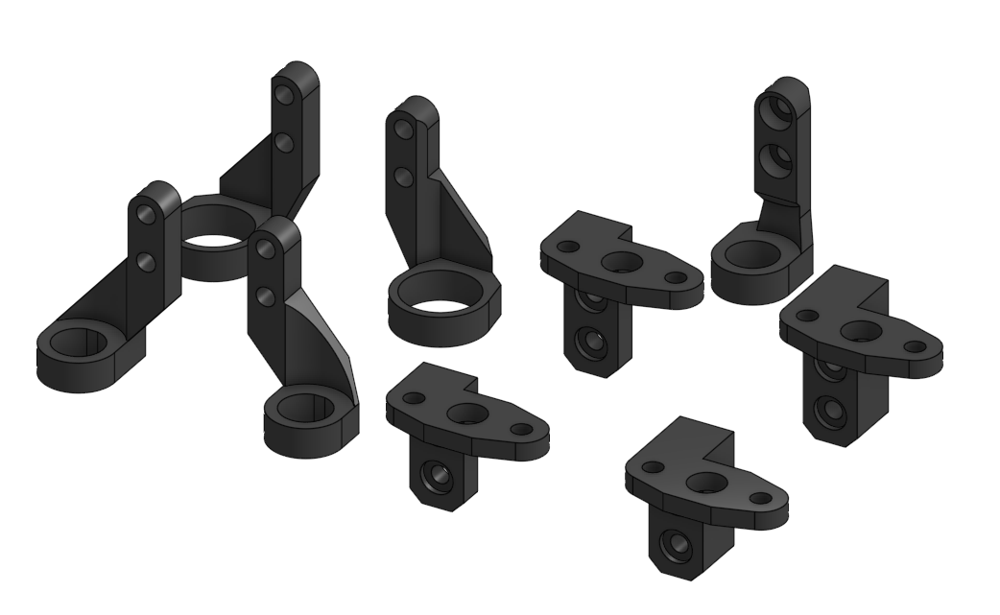
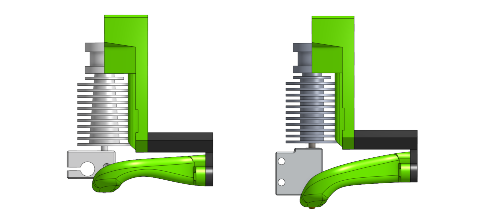

# Getting started

EVA is **very** modular - this means that the final carriage assembly is achieved by picking a proper set of sub assemblies.

Sub assemblies are built out of different printed, hardware and electronic parts.

A complete EVA carriage is built out of 4 major parts:

- [front](#front-extruders) - which is the main part differentiating which hotend variant is used
- [top](#tops) - with the front may differ from variant to variant, also changes for different MGN sizes
- [bottom](#bottoms) - first of all, changes from MGN sizes but then may differ for different fans
- [back](#backs-motion-system) - with fronts the most complex part - changes for different motion systems (Cartesian, IDEX, CoreXY)

Then there are extra parts like:

- [cable holders](#cable-holders)
- [tension sliders](#tension-sliders) - those depend on the back used
- [probe holders](#bed-probes)
- [layer cooling](#layer-cooling)

## How to pick your parts?

I understand there are lots of parts and that maybe misleading but it really boils down to a few decisions that you probably made at this point.

### Front - Extruders

The front part is quite obviously the most vivid piece when it comes to different extruders so the selection of the front part should be easy enough.
The V6 faces use an additional part that holds a 40mm fan.

!!! info "BMG"

    BMG face uses the `face_v6` part since it's mounting is handled by the top part.

!!! info "Long screw direction"

    Notice how on the front heavy (Aero and Hemera) faces the screws are threaded from the back.

### Tops

The first decision is most likely already made, MGN12 vs MGN15. Then there's the plain top and the special BMG top.

### Bottoms

Simillarly to tops those are nothing special - the duct extension length is the only thing that's different from one variant to another. That length depends on the MGN variant and different faces. They marked as either short or long.

### Backs - Motion system

If you are looking to use EVA on a CoreXY device you need to look for the `back_corexy` stl files.

Pick the fan angle you need - 60deg is the default but 90deg saves most space in Y, where in some cases the 30deg anged fan can fit under the frame thus providing more space in Y. Those backs require the M5 tension sliders.

The Cartesian and IDEX backs are simillar - to be honest the Cartesian back is just a simplified IDEX back. Those use the M3 tensions sliders - those sliders are not easy to work with, can swell in the back part but work.

### Extras

#### Cable Holders

In version 1.3.0 cable holders were moved from the top to the back (although some tops may still, coincidentally have a place for a cable holder). There are two variants, one leading the cables to the back (mostly suitable for Cartesians) and the universal one.

#### Tension Sliders

If you have a 6mm belt based printer or the orientation of the teeth on your belts are diffreent then look for different sliders - there's quite a few provided:

!!! info "Mirror and flip"
    You'll find 4 different variants for each slider. `flip` have the teeth on a different face and `mirror` are just mirrored.

#### Bed probes

EVA platform follows a simple standard for different bed probe mounts. Each carriage has 2 vertically alligned M3 screw holes, 8mm apart.
All probe mounts follow this standard but there are special veriants of probes where a probe mount had to be modified to fit a carriage (i.e. BL-Touch on the Aero Assembly have the `thick` name).

#### Layer Cooling

##### Horns Duct

Since version 1.2.0 EVA has support for Volcano hot ends. Notice the ones called `risen` - those have a higier tolerance if you'll run into issues with the standard ones (the tips are moved 1mm more from the bed):

##### RHD

In 1.3.0 a [MK3 RHD Fan Duct Rev. C](https://www.thingiverse.com/thing:3249344) remix was added, it does not have a Volcano variant but is narrower than Horns Duct which maybe important for an IDEX assembly

##### Computational Fluid Dynamics (CFD)

The Horns Duct v2 project is now a part of the EVA platform. I get a lot of questions around the performance of the layer cooling. I can't give you more than subjective promises and the result of a simulation I did for the EVA platform:

!!! info
    the air on the inlet was calibrated to a Sunon MF50151VX-B00U-A99 radial fan and the 60deg version of the back

