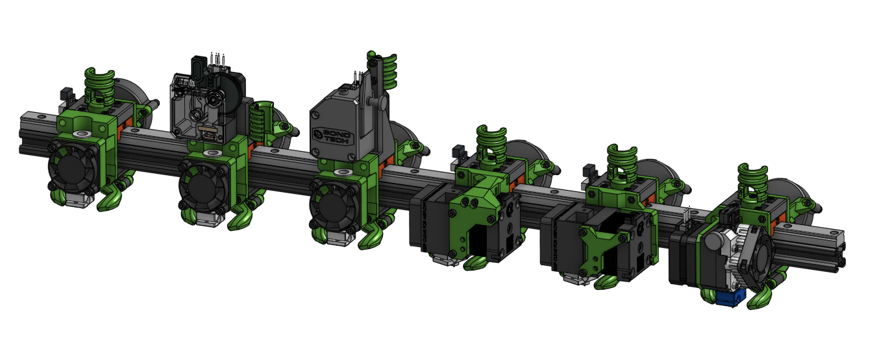

# EVA Carriages

## Platform

EVA is a platform for ==MGN12 and MGN15== rail based 3D Printer carriages. Mainstream support fouses on [Rat Rig](https://www.ratrig.com/) 3D printers but it's customizable enough to support different systems.

Rather lenghty video descriptions can be found on [the YouTube playlist](https://www.youtube.com/playlist?list=PLR8LTCniA766Mg1a88iF8xhOlvZR-Rc3A).

## Download

This manual is full of links to specific parts, {==**but there is no need to download those one by one**==} the full repository can be **[downloaded as a ZIP file](https://github.com/pkucmus/EVA/archive/master.zip)**.

## Examples

For Rat Rig V-core Pro the [Easy Mod](https://github.com/pkucmus/Easy-Mod) is required to change the X and Y rail orientation.

## Contribution

Issues, problems, feature requests, requests for compatibility with different printers can be requested in the project's [issue tracker](https://github.com/pkucmus/EVA/issues).

## Attributions

One does not need a keen eye to see that this design it's based on many different designs that are out in the wild - although all the parts here are made from scratch - their authors deserve credit (their work provided inspiration):

* [Rat Rig](https://www.ratrig.com/) for making the V-core which is the perfect sanbox for building and modding a 3D Printer
* [pekcitron](https://www.thingiverse.com/pekcitron/about) for the [Prusa Bear Upgrade](https://www.thingiverse.com/thing:2808408)
* [BLV](https://www.thingiverse.com/BLV/about) and his amazing [BLV mgn cube](https://www.thingiverse.com/thing:3382718)

## Configurability

### Bed probes

EVA platform follows a simple standard for different bed probe mounts. Each carriage has 2 vertically alligned M3 screw holes, 8mm apart.
All probe mounts follow this standard but there are special veriants of probes where a probe mount had to be modified to fit a carriage (i.e. BL-Touch on the Aero Assembly).

| Probe Type           | File                 | Link                                                                                         |
| -------------------- | -------------------- | -------------------------------------------------------------------------------------------- |
| 8mm inductive probe  | lj8_probe_right.stl  | [GitHub](https://github.com/pkucmus/EVA/blob/master/stl/Probe%20Mounts/lj8_probe_right.stl)  |
| 8mm inductive probe  | lj8_probe_left.stl   | [GitHub](https://github.com/pkucmus/EVA/blob/master/stl/Probe%20Mounts/lj8_probe_left.stl)   |
| 8mm inductive probe  | lj8_probe_center.stl | [GitHub](https://github.com/pkucmus/EVA/blob/master/stl/Probe%20Mounts/lj8_probe_center.stl) |
| 12mm inductive probe | lj12_probe_right.stl | [GitHub](https://github.com/pkucmus/EVA/blob/master/stl/Probe%20Mounts/lj12_probe_right.stl) |
| 12mm inductive probe | lj12_probe_left.stl  | [GitHub](https://github.com/pkucmus/EVA/blob/master/stl/Probe%20Mounts/lj12_probe_left.stl)  |
| BL-Touch             | bl_touch.stl         | [GitHub](https://github.com/pkucmus/EVA/blob/master/stl/Probe%20Mounts/bl_touch.stl)         |
| BL-Touch             | bl_touch_thick.stl   | [GitHub](https://github.com/pkucmus/EVA/blob/master/stl/Probe%20Mounts/bl_touch_thick.stl)   |

### MGN12 and MGN15

All listed assemblies are pointing to MGN15 variants but a smaller (and probably better) MGN12 vartiant is now also available. MGN12 is lighter so it's a good choice for a CoreXY system to make the X rail assembly lighter. Both variants are fully compatible with each other, which means that you only need to change the MGN rail, your top and bottom parts and you are set.

### Back Fan duct angles

There are 5 different variants available. From the least Y space consuming 90deg variant down to 30deg that can potentially fit under the frame while providing a straight air path to the duct.

### Tension Sliders

If you have a 6mm belt based printer or the orientation of the teeth on your belts are diffreent then look for different sliders - there's quite a few provided:

