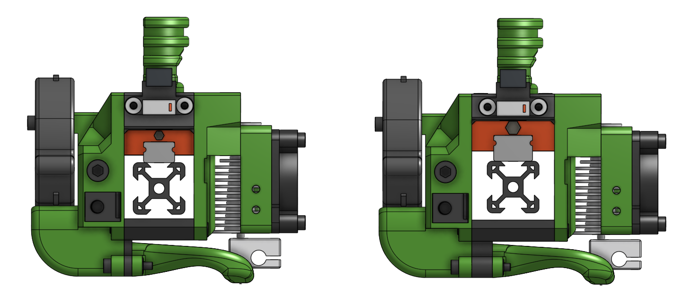

# EVA Carriages

## Platform

EVA is a platform for ==MGN12 and MGN15== rail based 3D Printer carriages. Mainstream support fouses on [Rat Rig](https://www.ratrig.com/) 3D printers but it's customizable enough to support different systems.

If you are looking for guidance after you decided to use EVA [Getting started](/getting_started) is probably what you are looking for.

Rather lenghty video descriptions can be found on [the YouTube playlist](https://www.youtube.com/playlist?list=PLR8LTCniA766Mg1a88iF8xhOlvZR-Rc3A).

## Download

This manual is full of links to specific parts, {==**but there is no need to download those one by one**==} the full repository can be **[downloaded as a ZIP file](https://github.com/pkucmus/EVA/archive/master.zip)**.

## MGN12 and MGN15

All listed assemblies are pointing to MGN15 variants but a smaller (and probably better) MGN12 vartiant is now also available. MGN12 is lighter so it's a good choice for a CoreXY system to make the X rail assembly lighter. Both variants are fully compatible with each other, which means that you only need to change the MGN rail, your top and bottom parts and you are set.

## Examples

For Rat Rig V-core Pro the [Easy Mod](https://github.com/pkucmus/Easy-Mod) is required to change the X and Y rail orientation.

EVA is now officially used by Rat Rig in their products :tada: :

* [V-core Pro (with Easy Mod)](https://www.ratrig.com/3d-printing-cnc/3d-printer-kits/complete-kits/rat-rig-v-core-pro-linear-rail-701.html)
* [V-cast](https://www.ratrig.com/3d-printing-cnc/3d-printer-kits/complete-kits/rat-rig-v-cast.html)

## Contribution

Issues, problems, feature requests, requests for compatibility with different printers can be requested in the project's [issue tracker](https://github.com/pkucmus/EVA/issues).

## Attributions

One does not need a keen eye to see that this design it's based on many different designs that are out in the wild - although all the parts here are made from scratch - their authors deserve credit (their work provided inspiration):

* [Rat Rig](https://www.ratrig.com/) for making the V-core which is the perfect sanbox for building and modding a 3D Printer
* [pekcitron](https://www.thingiverse.com/pekcitron/about) for the [Prusa Bear Upgrade](https://www.thingiverse.com/thing:2808408)
* [BLV](https://www.thingiverse.com/BLV/about) and his amazing [BLV mgn cube](https://www.thingiverse.com/thing:3382718)

Also, by name for their amazing work - making some of the parts, providing guidance, testing parts, keeping me in check. Their input was a huge help so please do me a fovor and checkout their work:

* [Olof Ogland](http://www.olofogland.se)
* [Simon Davie](http://www.nexxdesign.co.uk)
* [João Barros](http://www.joaobarros.pt)

THANK YOU!

## Contact

If you need a more direct contact I'm on the [Rat Rig Unofficial Discord Server](https://discord.gg/DcCEk8u).
