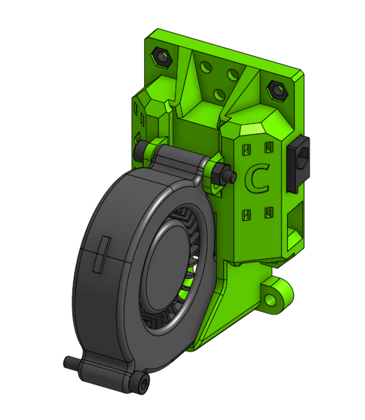
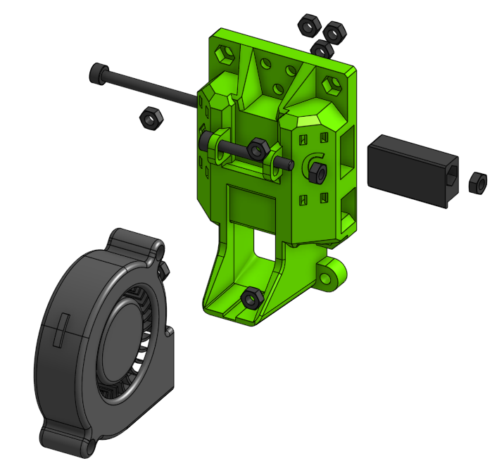

# Sub assembly back_cartesian 

## BOM

| Name | Qty | Type | Link |
| ---- | --- | ---- | ---- |
| **M3 x 20mm** | 1 | hardware |  |
| **M3 x 25mm** | 1 | hardware |  |
| **M3 x 35mm** | 1 | hardware |  |
| **M3 hex nut** | 9 | hardware |  |
| **5015 Blower Fan** | 1 | electronics |  |
| **tension_slider_6mm_belt_M3** | 2 | printed | [GitHub](https://github.com/pkucmus/EVA/tree/master/stl/Tension%20Sliders/tension_slider_6mm_belt_M3.stl) |
| **back_cartesian** | 1 | printed | [GitHub](https://github.com/pkucmus/EVA/tree/master/stl/Backs/back_cartesian.stl) |

^**bold**\ are\ required\ parts^

## Images

### Assembled

### Exploded

