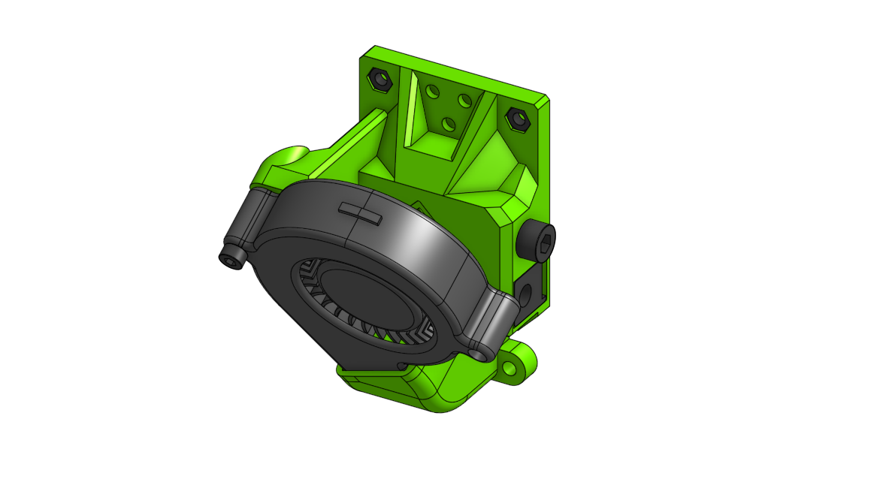
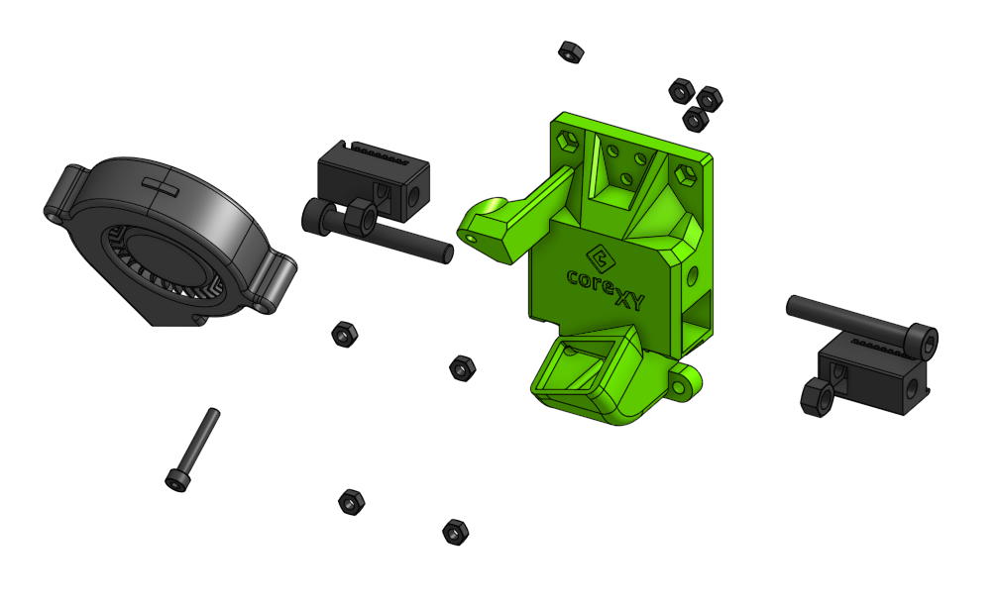

# Sub assembly back_corexy 

## BOM

| Name | Qty | Type | Link |
| ---- | --- | ---- | ---- |
| **M3 x 20mm** | 1 | hardware |  |
| **M5 x 35mm** | 2 | hardware |  |
| **M3 hex nut** | 8 | hardware |  |
| **M5 hex nut** | 2 | hardware |  |
| **5015 Blower Fan** | 1 | electronics |  |
| **tension_slider_9mm_belt_M5** | 1 | printed | [GitHub](https://github.com/pkucmus/EVA/tree/master/stl/Tension%20Sliders/tension_slider_9mm_belt_M5.stl) |
| **tension_slider_9mm_belt_M5_mirror** | 1 | printed | [GitHub](https://github.com/pkucmus/EVA/tree/master/stl/Tension%20Sliders/tension_slider_9mm_belt_M5_mirror.stl) |
| **back_corexy_60deg** | 1 | printed | [GitHub](https://github.com/pkucmus/EVA/tree/master/stl/Backs/back_corexy_60deg.stl) |

^**bold**\ are\ required\ parts^

## Images

### Assembled

### Exploded

