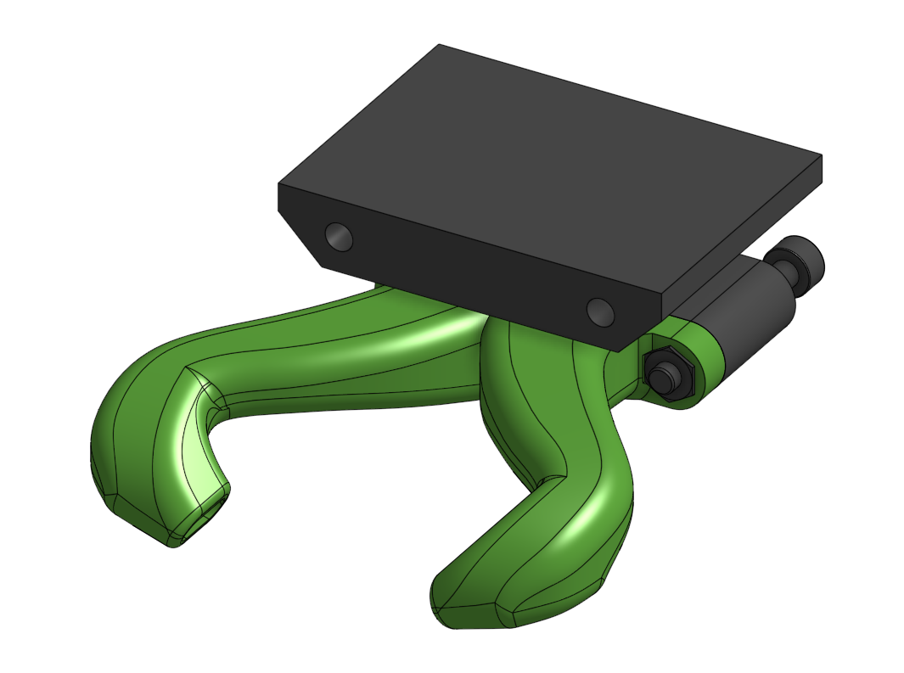

# bottom_MGN15_14mm Sub assembly

??? info "Used in"
    
    * [Titan Aero Assembly](../../assemblies/titan_aero)
    

## BOM

| Name | Qty | Type | Link |
| ---- | --- | ---- | ---- |
| M3 x 25mm | 2 | hardware |  |
| M3 hex nut | 2 | hardware |  |
| bottom_MGN15_14mm_duct | 1 | printed | [GitHub](https://github.com/pkucmus/EVA/tree/master/stl/Bottoms/bottom_MGN15_14mm_duct.stl) |
| horn_duct_v2_straight | 1 | printed | [GitHub](https://github.com/pkucmus/EVA/tree/master/stl/horn_duct_v2_straight.stl) |

## Images

### Assembled

### Exploded

