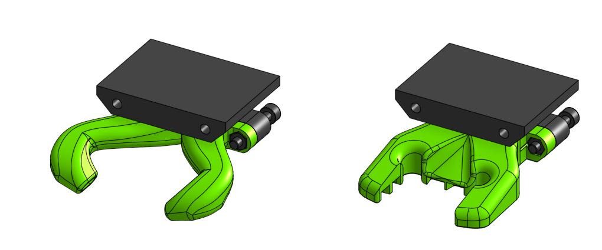

# Sub assembly bottom_mgn15_short 

## BOM

| Name | Qty | Type | Link |
| ---- | --- | ---- | ---- |
| **M3 x 20mm** | 2 | hardware |  |
| **M3 hex nut** | 2 | hardware |  |
| **bottom_mgn15_short_duct** | 1 | printed | [GitHub](https://github.com/pkucmus/EVA/tree/master/stl/Bottoms/bottom_mgn15_short_duct.stl) |
| **horn_duct_v2_straight** | 1 | printed | [GitHub](https://github.com/pkucmus/EVA/tree/master/stl/Fan%20Ducts/horn_duct_v2_straight.stl) |

^**bold**\ are\ required\ parts^

## Images

### Assembled

### Exploded

