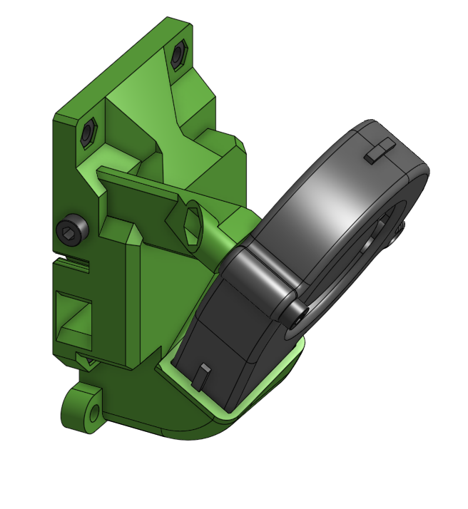
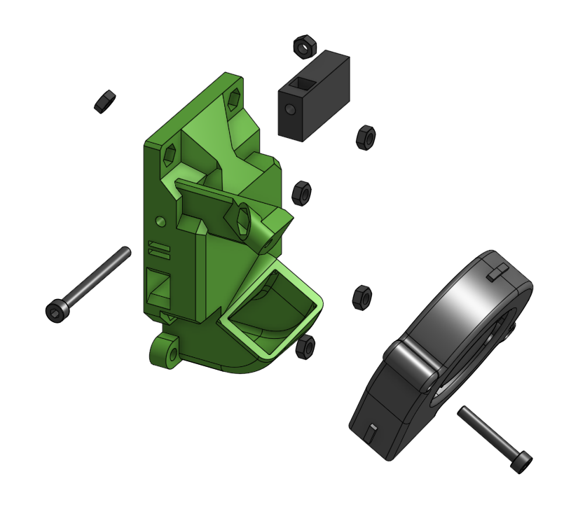

# cartesian_back Sub assembly

!!! info "More angles"
    Check the [Printed parts](../../printed_parts/) page for more fan angles

??? info "Not used in an assembly"
    Please try it out and let me know how it went in the [issue tracker](https://github.com/pkucmus/EVA/issues).

## BOM

| Name | Qty | Type | Link |
| ---- | --- | ---- | ---- |
| M3 x 20mm | 1 | hardware |  |
| M3 x 35mm | 1 | hardware |  |
| M3 hex nut | 6 | hardware |  |
| 5015 Blower Fan | 1 | electronics |  |
| tension_slider_6mm_belt_M3 | 2 | printed | [GitHub](https://github.com/pkucmus/EVA/tree/master/stl/Backs/tension_slider_6mm_belt_M3.stl) |
| back_cartesian_60deg | 1 | printed | [GitHub](https://github.com/pkucmus/EVA/tree/master/stl/Backs/back_cartesian_60deg.stl) |

## Images

### Assembled

### Exploded

