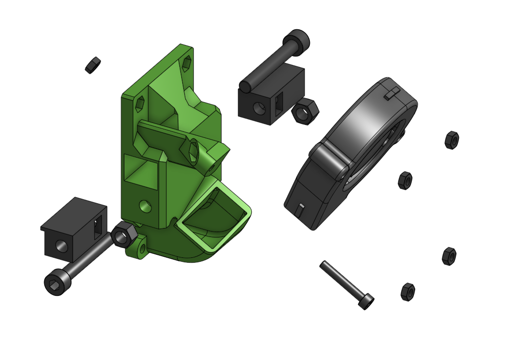

# core_xy_back Sub assembly

!!! info "More angles"
    Check the [Printed parts](../../printed_parts/) page for more fan angles

??? info "Used in"
    
    * [V6 Bowden Assembly](../../assemblies/v6_bowden)
    
    * [V6 Titan Assembly](../../assemblies/v6_titan)
    
    * [Titan Aero Assembly](../../assemblies/titan_aero)
    
    * [V6 BMG Assembly](../../assemblies/v6_bmg)
    
    * [Hemera Assembly](../../assemblies/hemera)
    
    * [Hemera Alternative Assembly](../../assemblies/hemera_alt)
    

## BOM

| Name | Qty | Type | Link |
| ---- | --- | ---- | ---- |
| M3 x 20mm | 1 | hardware |  |
| M5 x 35mm | 2 | hardware |  |
| M3 hex nut | 5 | hardware |  |
| M5 hex nut | 2 | hardware |  |
| 5015 Blower Fan | 1 | electronics |  |
| tension_slider_9mm_belt_M5 | 2 | printed | [GitHub](https://github.com/pkucmus/EVA/tree/master/stl/Backs/tension_slider_9mm_belt_M5.stl) |
| back_corexy_60deg | 1 | printed | [GitHub](https://github.com/pkucmus/EVA/tree/master/stl/Backs/back_corexy_60deg.stl) |

## Images

### Assembled

### Exploded

