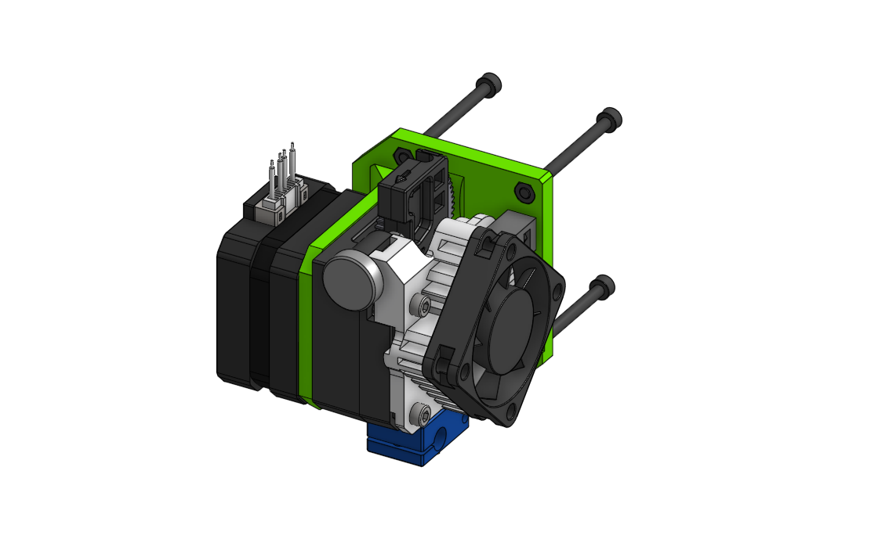
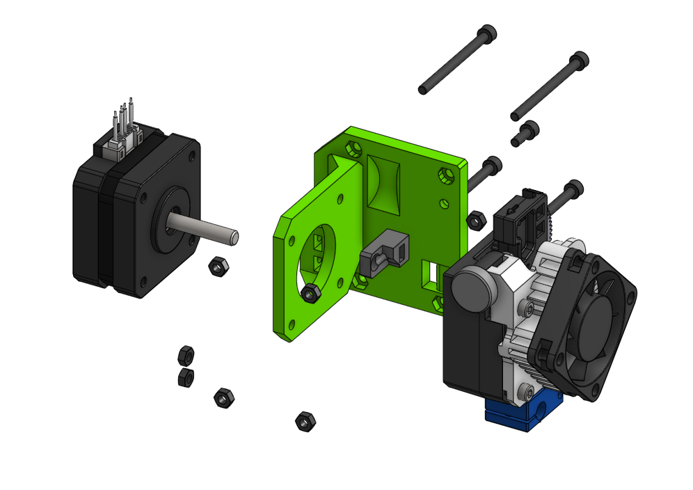

# Sub assembly face_aero 

The mentioned 23 Nema 17 motor is in this case an example - it can be thicker, in the expence of X space

## BOM

| Name | Qty | Type | Link |
| ---- | --- | ---- | ---- |
| **M3 x 40mm** | 4 | hardware |  |
| **M3 x 8mm** | 1 | hardware |  |
| **M3 hex nut** | 7 | hardware |  |
| **face_aero** | 1 | printed | [GitHub](https://github.com/pkucmus/EVA/tree/master/stl/Faces/face_aero.stl) |
| **face_aero_support** | 1 | printed | [GitHub](https://github.com/pkucmus/EVA/tree/master/stl/Faces/face_aero_support.stl) |
| **E3D Titan Aero** | 1 | other |  |
| **Nema 17 Pancake 23mm** | 1 | electronics |  |

^**bold**\ are\ required\ parts^

## Images

### Assembled

### Exploded

