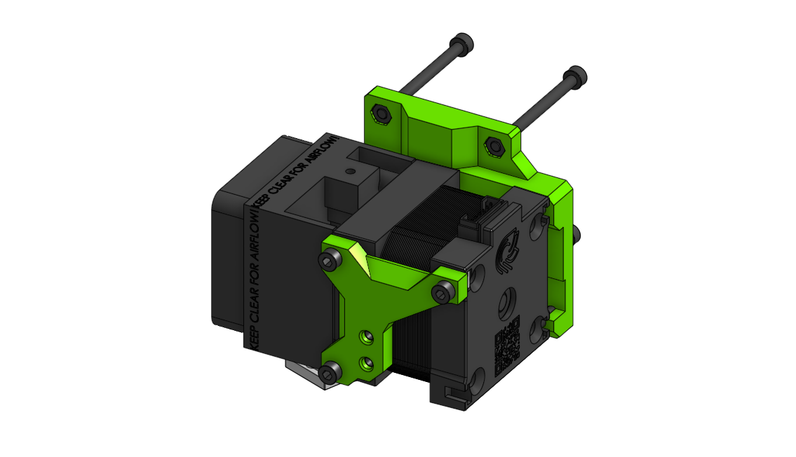
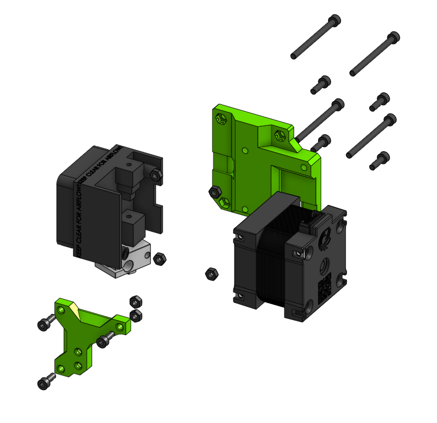

# Sub assembly face_hemera 

## BOM

| Name | Qty | Type | Link |
| ---- | --- | ---- | ---- |
| **M3 x 40mm** | 4 | hardware |  |
| **M3 x 35mm** | 2 | hardware |  |
| **M3 x 10mm** | 6 | hardware |  |
| **M3 x 8mm** | 3 | hardware |  |
| **M3 hex nut** | 6 | hardware |  |
| **face_hemera** | 1 | printed | [GitHub](https://github.com/pkucmus/EVA/tree/master/stl/Faces/face_hemera.stl) |
| **face_hemera_front** | 1 | printed | [GitHub](https://github.com/pkucmus/EVA/tree/master/stl/Faces/face_hemera_front.stl) |
| **E3D Hemera** | 1 | other |  |

^**bold**\ are\ required\ parts^

## Images

### Assembled

### Exploded

