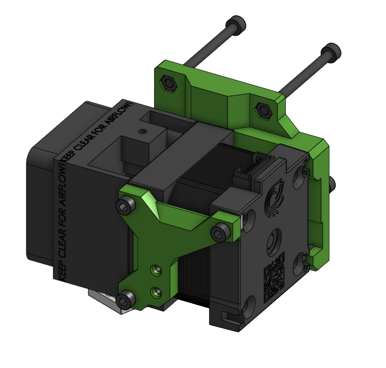
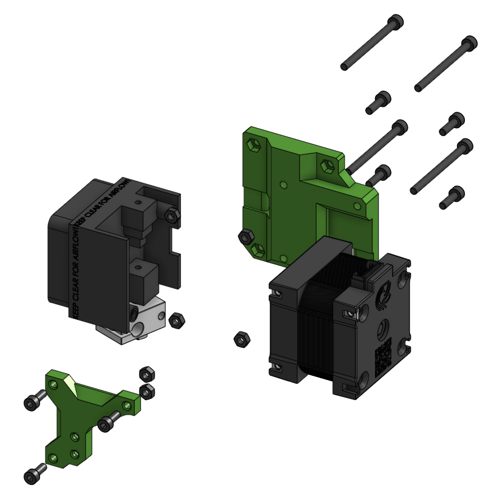

# face_hemera_alt Sub assembly

??? info "Used in"
    
    * [Hemera Alternative Assembly](../../assemblies/hemera_alt)
    

## BOM

| Name | Qty | Type | Link |
| ---- | --- | ---- | ---- |
| M3 x 40mm | 4 | hardware |  |
| M3 x 10mm | 4 | hardware |  |
| M3 x 8mm | 3 | hardware |  |
| M3 hex nut | 6 | hardware |  |
| face_hemera_alt | 1 | printed | [GitHub](https://github.com/pkucmus/EVA/tree/master/stl/Faces/face_hemera_alt.stl) |
| face_hemera_alt_probe | 1 | printed | [GitHub](https://github.com/pkucmus/EVA/tree/master/stl/Faces/face_hemera_alt_probe.stl) |
| E3D Hemera | 1 | other |  |

## Images

### Assembled

### Exploded

