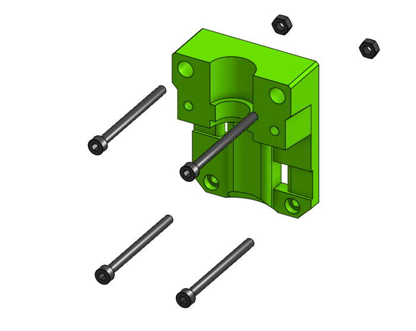

# Sub assembly face_v6 

## BOM

| Name | Qty | Type | Link |
| ---- | --- | ---- | ---- |
| **M3 x 40mm** | 4 | hardware |  |
| **M3 hex nut** | 2 | hardware |  |
| **face_v6** | 1 | printed | [GitHub](https://github.com/pkucmus/EVA/tree/master/stl/Faces/face_v6.stl) |

^**bold**\ are\ required\ parts^

## Images

### Assembled

### Exploded

