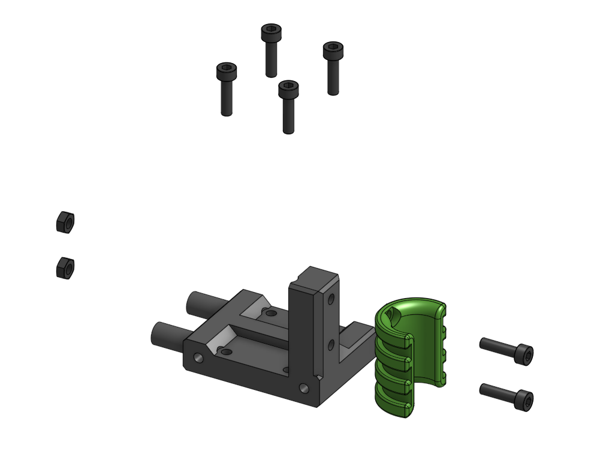

# top_MGN15_titan Sub assembly

??? info "Used in"
    
    * [V6 Titan Assembly](../../assemblies/v6_titan)
    

## BOM

| Name | Qty | Type | Link |
| ---- | --- | ---- | ---- |
| M3 x 12mm | 4 | hardware |  |
| M3 x 10mm | 2 | hardware |  |
| M3 hex nut | 2 | hardware |  |
| cable_side | 1 | printed | [GitHub](https://github.com/pkucmus/EVA/tree/master/stl/Cable%20Mounts/cable_side.stl) |
| top_MGN15_titan | 1 | printed | [GitHub](https://github.com/pkucmus/EVA/tree/master/stl/Tops/top_MGN15_titan.stl) |

## Images

### Assembled

### Exploded

