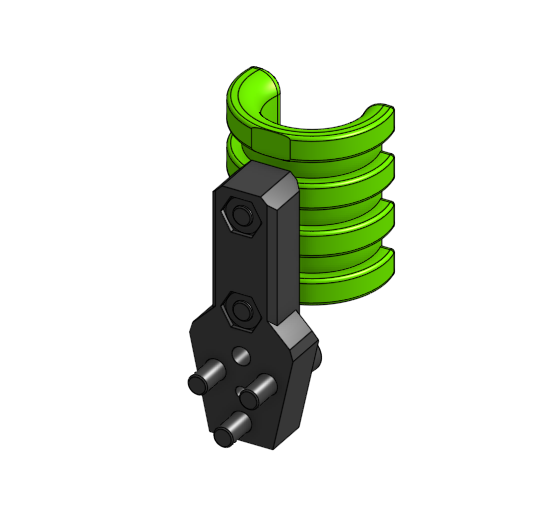
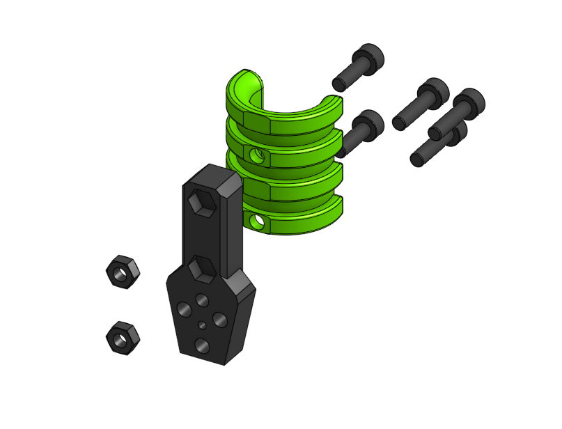

# Sub assembly universal_cable 

## BOM

| Name | Qty | Type | Link |
| ---- | --- | ---- | ---- |
| **M3 x 10mm** | 2 | hardware |  |
| **M3 x 12mm** | 3 | hardware |  |
| **M3 hex nut** | 2 | hardware |  |
| **cable_side** | 1 | printed | [GitHub](https://github.com/pkucmus/EVA/tree/master/stl/Cable%20Mounts/cable_side.stl) |
| **unversal_cable_mount** | 1 | printed | [GitHub](https://github.com/pkucmus/EVA/tree/master/stl/Cable%20Mounts/unversal_cable_mount.stl) |

^**bold**\ are\ required\ parts^

## Images

### Assembled

### Exploded

