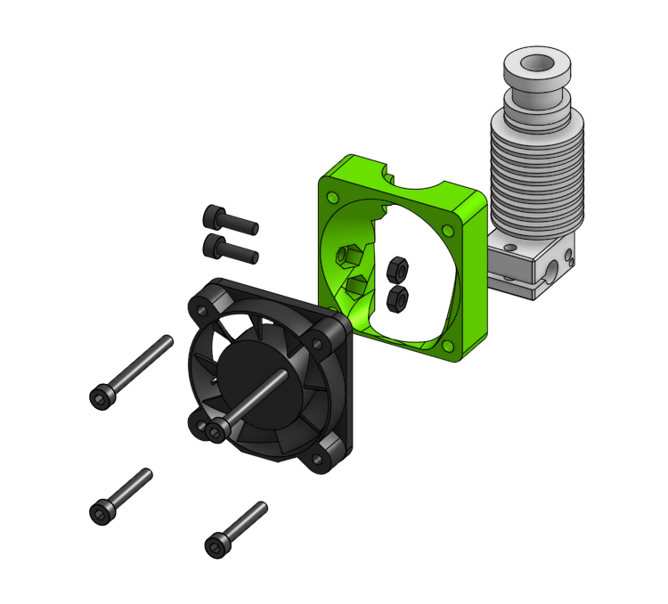

# v6 Sub assembly

Provides E3D V6 Hotend clamping and holds the Hotend fan. The top 30mm 
screws go though the 3m nuts in the choosen _face_ part.

??? info "Used in"
    
    * [V6 Bowden Assembly](../../assemblies/v6_bowden)
    
    * [V6 Titan Assembly](../../assemblies/v6_titan)
    
    * [Titan Aero Assembly](../../assemblies/titan_aero)
    
    * [V6 BMG Assembly](../../assemblies/v6_bmg)
    
    * [Hemera Assembly](../../assemblies/hemera)
    
    * [Hemera Alternative Assembly](../../assemblies/hemera_alt)
    

## BOM

| Name | Qty | Type | Link |
| ---- | --- | ---- | ---- |
| 4010/4020 Radial Fan | 1 | electronics |  |
| E3D V6 Hotend | 1 | other |  |
| M3 x 20mm | 2 | hardware |  |
| M3 x 30mm | 2 | hardware |  |
| M3 hex nut | 2 | hardware |  |
| face_v6_40mm_fan | 1 | printed | [GitHub](https://github.com/pkucmus/EVA/tree/master/stl/Faces/face_v6_40mm_fan.stl) |

## Images

### Assembled

### Exploded

